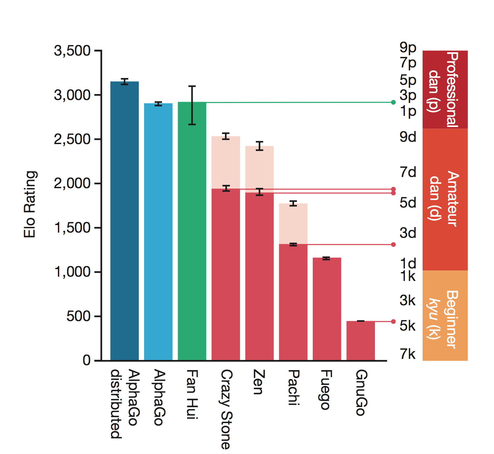

# Research Review of AlphaGo

* author: Xin Chen
* email: Bismarrck@me.com

### 1. Background

The game of Go has long been viewed as one of the most difficult challenges for computers to solve as the complexity can be as large as $10^{170}$, thus makeing it almost impossible to use traditional Monte Carlo rollout searches. Recently, [Google](https://www.nature.com/nature/journal/v529/n7587/full/nature16961.html) developed a new new artificial intelligence, named **AlphaGo**, which can beat the most skillful human Go players. 

### 2. Method

The framework of **AlphaGo** is mainly constructed with three parts:

1. Supervised Learning (SL) policy network $p_{\sigma}$
2. Reinforcement Learning (RL) policy network $p_{\rho}$
3. A value network $\nu_{\theta}$ that predicts the winner of games played by the RL policy network against itself.

#### 2.1 Supervised Learning (SL) policy network

The supervised learning policy network is a deep convolutional neural network with 13 layers and rectifier activations. The boards are passed as images (19x19) to this network. The final layer is a softmax layer which outputs the probability distribution of all next legal moves. 30 million positions from the KGS Go Server are used to train this network.

#### 2.2 Reinforcement Learning (RL) policy network

The reinforcement learning policy network aims at improveing the supervised learning policy network. The structure of RL is identical to SL. The initial weights are the same. RL is improved by policy gradient learning to maximize the outcome (that is, winning more games) against previous versions of the policy network. A new data set is generated by playing games of self-play with the RL policy network.

#### 2.3 Value Network

The final value network is a regression neural network which is trained predict the expected outcome (that is, whether the current player wins) in positions from the self-play data set.

### 3. Results

The release of **AlphaGo** was one of the most influential event in 2016. **AlphaGo** showed an amazing ability to play the game of Go and completely beated almost all top professional human Go players in 2016.

#### 3.1 Jan, 2016

The ELO of the first public release **AlphaGo** was around 3000, which was roughly ranked as a _2 to 3 dan_ professional. **AlphaGo** sucessfully beated Hui Fan (2 _dan_ professional) with a 5:0 and this is also the [first time](https://en.wikipedia.org/wiki/Fan_Hui) an AI has beaten a human professional player at the game without a handicap.

#### 3.2 March, 2016

The upgraded **AlphaGo** Lee Sedol in a five-game match, the first time a computer Go program has beaten a 9-dan professional without handicaps. Lee Sedol was considered as the second best human Go player at this time, only after the Chinese Ke Jie.

#### 3.3 Jan, 2017

Around the new year of 2017, the further upgraded **AlphaGo**, named **Master**, challenged human players on [Tygem](https://en.wikipedia.org/wiki/Tygem) server and secured a 60 consecutive wins. None of the professional players from China, South Korea and Japan could win a single match.

#### 3.4 May, 2017

The final version of **AlphaGo** beated Ke Jie, the No. 1 human Go player in the world with 3 to 0. After this event, [**AlphaGo** was retired](https://www.wired.com/2017/05/win-china-alphagos-designers-explore-new-ai/).
